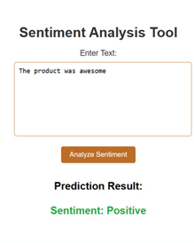
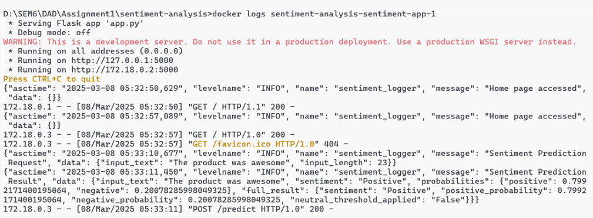
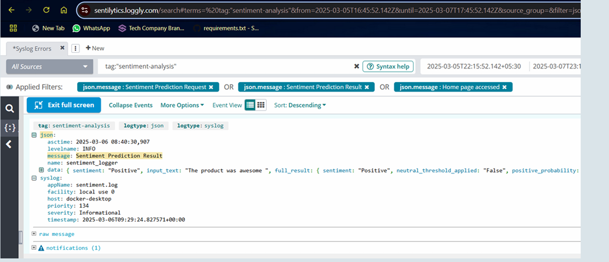

# Sentiment Analysis Microservices Project

A containerized sentiment analysis application implementing **Sidecar** and **Ambassador** design patterns for enhanced logging and proxy capabilities.

## 🏗️ Architecture Overview

This project demonstrates modern microservices design patterns:

- **📱 Main Application**: Flask-based sentiment analysis service
- **🔄 Ambassador Pattern**: Nginx reverse proxy for load balancing and routing
- **📊 Sidecar Pattern**: Loggly integration for centralized log management

```
┌─────────────────┐    ┌──────────────────┐    ┌─────────────────┐
│   Ambassador    │────│  Sentiment App   │────│    Sidecar      │
│  (Nginx Proxy)  │    │   (Flask API)    │    │ (Loggly Logger) │
└─────────────────┘    └──────────────────┘    └─────────────────┘
```

## 🚀 Features

- **Sentiment Analysis**: ML-powered text sentiment classification
- **Reverse Proxy**: Nginx ambassador for request routing
- **Centralized Logging**: Automatic log shipping to Loggly
- **Containerized**: Fully dockerized microservices
- **Production Ready**: Optimized for deployment

## 📋 Prerequisites

- Docker & Docker Compose
- Git
- Loggly account (for log management)

## 🛠️ Installation & Setup

### 1. Clone the Repository

```bash
git clone https://github.com/yourusername/sentiment-analysis.git
cd sentiment-analysis
```

### 2. Configure Environment Variables

Create a `.env` file or update the docker-compose.yml with your Loggly credentials:

```bash
# Loggly Configuration
LOGGLY_TOKEN=your-loggly-token
LOGGLY_ACCOUNT=your-loggly-account
USERNAME=your-username
PASSWORD=your-password
```

### 3. Build and Run

```bash
# Build and start all services
docker-compose up --build

# Run in background
docker-compose up -d --build
```

## 🔧 Service Configuration

### Ambassador Service (Nginx)
- **Port**: 80 (HTTP)
- **Purpose**: Reverse proxy and load balancer
- **Config**: `nginx.conf`

### Sentiment App (Flask)
- **Port**: 5000
- **Framework**: Flask
- **Model**: `model_lr.pkl`
- **Vectorizer**: `tfidf_vectorizer.pkl`

### Sidecar Logger (Loggly)
- **Purpose**: Log aggregation and shipping
- **Monitors**: Application logs and prediction logs
- **Retry Logic**: 3 attempts with 5s intervals

## 📁 Project Structure

```
sentiment-analysis/
├── 📂 logs/                    # Application logs
├── 📂 prediction_logs/         # ML prediction logs  
├── 📂 templates/              # HTML templates
├── 🐍 app.py                  # Flask application
├── 🐳 Dockerfile             # Container definition
├── 🐳 docker-compose.yml     # Service orchestration
├── ⚙️ nginx.conf             # Nginx configuration
├── 🤖 model_lr.pkl           # Trained ML model
├── 📊 tfidf_vectorizer.pkl   # Text vectorizer
├── 📦 requirements.txt       # Python dependencies
└── 📖 README.md              # This file
```

## Screenshots

### Application Interface


*Main application interface for sentiment analysis*

### Docker Services Running


*All microservices running successfully*

### Loggly Dashboard


*Centralized logging dashboard showing application metrics*


## 🔍 API Endpoints

### Sentiment Analysis
```http
POST /predict
Content-Type: application/json

{
  "text": "I love this product!"
}
```

**Response:**
```json
{
  "sentiment": "positive",
  "confidence": 0.87,
  "text": "I love this product!"
}
```

## 🐳 Docker Commands

```bash
# View running services
docker-compose ps

# View logs
docker-compose logs -f sentiment-app
docker-compose logs -f ambassador
docker-compose logs -f loggly-logger

# Stop services
docker-compose down

# Rebuild specific service
docker-compose build sentiment-app
```

## 📊 Monitoring & Logs

### Local Logs
- Application logs: `./logs/`
- Prediction logs: `./prediction_logs/`

### Loggly Dashboard
- Access your Loggly account to view centralized logs
- Filter by tag: `sentiment-analysis`
- Monitor application performance and errors


## 🚨 Troubleshooting

### Common Issues

1. **Port Conflicts**
   ```bash
   # Check if port 80 is in use
   netstat -tulpn | grep :80
   ```

2. **Loggly Connection Issues**
   - Verify your Loggly credentials
   - Check network connectivity
   - Review loggly-logger service logs

3. **Model Loading Errors**
   - Ensure `model_lr.pkl` and `tfidf_vectorizer.pkl` exist
   - Check file permissions

### Debug Commands
```bash
# Enter container shell
docker-compose exec sentiment-app /bin/bash

# Check service health
docker-compose exec sentiment-app curl localhost:5000/health
```

## 📝 License

This project is licensed under the MIT License - see the [LICENSE](LICENSE) file for details.

## 🙏 Acknowledgments

- Flask framework for web development
- Nginx for reverse proxy capabilities
- Loggly for log management
- Docker for containerization

---

**Happy Analyzing! 🎯**
